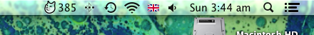

Weather Menulet
===============

Uses [forecast.io](http://forecast.io/)'s [weather API](https://developer.forecast.io/) to put the current temperature in your MacOS X machine's status/menu bar area.

Building
--------

To get this running:

1. Clone the repo
2. Open the project in XCode 4+
3. Create a [forecast.io developer account](https://developer.forecast.io/register) and obtain an API key.
4. Replace `api_key` in the `getWeatherFor:` method with your forecast.io API key.
5. Replace "Minneapolis, MN" with the location you want to get weather for.
6. Compile and run.
